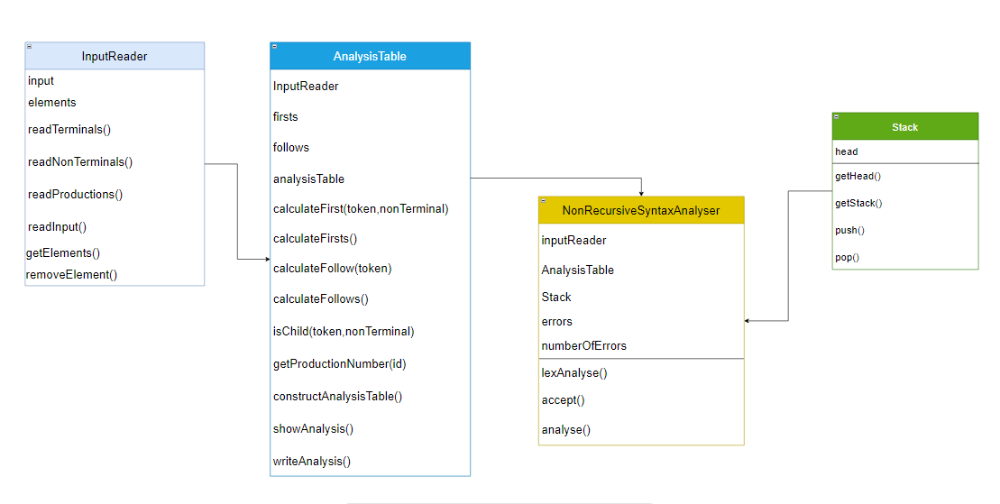
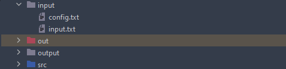
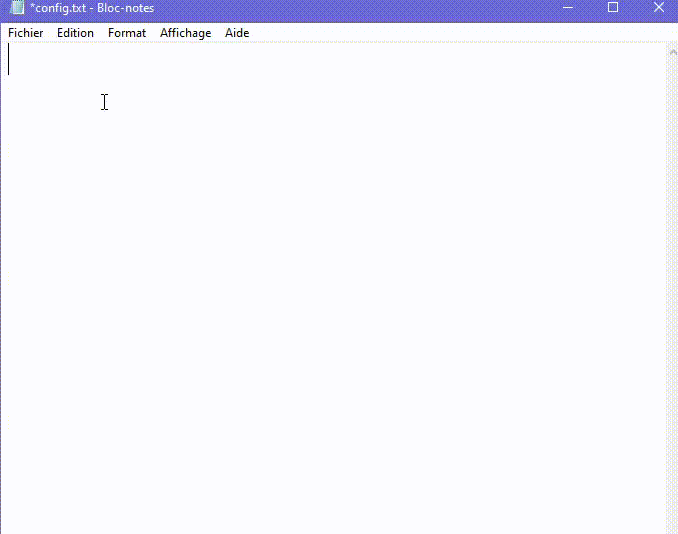
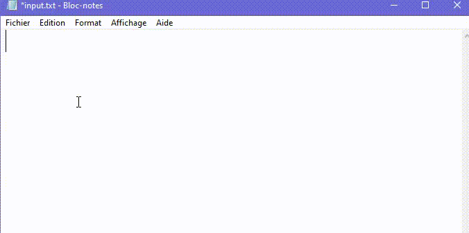
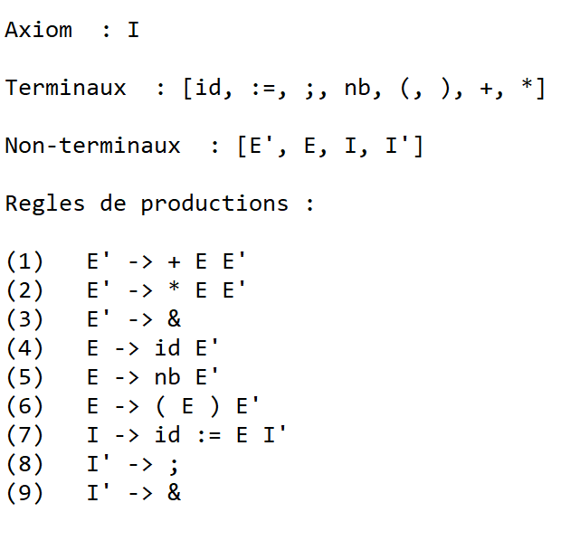
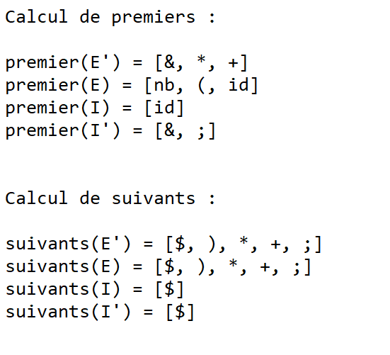
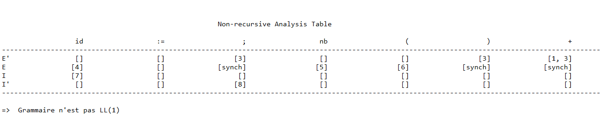
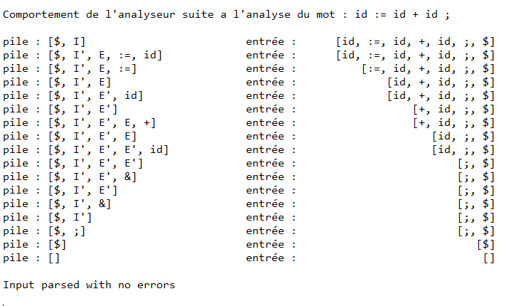

# Analyseur syntaxique 

## Overview

Une implementation JAVA de la methode d'analyse non recursif LL(1) d'une entrée suivant les regles d'un grammaire non-ambigue.

La solution accepte une configuration intiale a savoir la définition du grammaire  et l'entrée du mot a analyser.

l'analyse LL(1) est une methode d'anlayse syntaxique dans la phase du design d'un compilateur. 
Les composantes requise pour l'analyse sont l'input , la structure de la pile , la tableau d'analyse et un analyseur.

## Conception

La solution comporte 4 classes d'objet : Une pile, Une Table d'analyse, Un InputReader et un analyseur

voici une vue globale sur les differentes composantes et fonctionnalités de chaque Classe 

## Exemple pratique

La configuration initiale s'agit de définir un grammaire G = {terminaux,non terminaux, regle de production, axiom} et un mot a analyser

pour pouvoir tester l'analyseur il suffit d'editer les ficher config.txt et input.txt dans le dossier input de la répertoire racine.

 

pour definir un grammaire on utilise les trois mots clés : terminals , non terminals et productions
la premiere ligne doit contenir le mot clé "terminals", la ligne suivante doit donc contenir les terminaux 
du grammaire.
Toute les symboles doivent etre séparé par une seule espace 
la meme logique s'applique pour le mot clé "non terminals" et "productions"
l'axiom du grammaire est assumé etre la premiere règle de production 

 

apres avoir défini un grammaire est enregistrer le ficher config.txt on defini le mot a analyser en editant le fichier input.txt

en executant le fichier Main du projet apres la configuration Le programme ecrit un rapport d'analyse 

voici une exemple de l'output :

                                               Analyse Syntaxique prédictive non récursive

